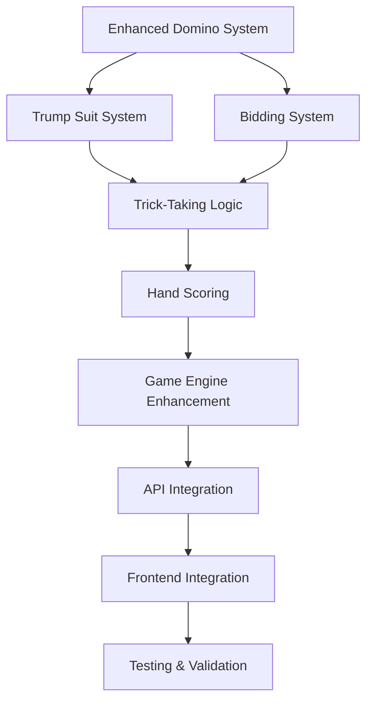

# Texas 42 Implementation Reconciliation Plan

## Overview

This document provides a detailed technical plan to update all game components (frontend, backend, data models, APIs) to implement the complete Texas 42 rules researched in the 8 rules research stories. The plan prioritizes changes by impact and dependencies to ensure systematic implementation of authentic Texas 42 gameplay.

## Implementation Strategy

### Phase 1: Foundation - Core Rule Implementation (Priority: 🔴 Critical)
**Estimated Effort**: 20-25 hours
**Dependencies**: None
**Goal**: Implement core game mechanics that enable basic authentic gameplay

#### 1.1 Enhanced Domino System (4-5 hours)
**Files to Modify**:
- `backend/src/types/texas42.ts`
- `frontend/src/types/texas42.ts`
- `backend/src/game/dominoes.ts`

**Changes Required**:
```typescript
// Enhanced Domino interface
export interface Domino {
  high: number;        // 0-6
  low: number;         // 0-6  
  id: string;          // unique identifier
  pointValue: number;  // 0, 5, or 10 points
  isCountDomino: boolean; // true for 5-0, 4-1, 3-2, 6-4, 5-5
}

// Point value calculation logic
export function calculateDominoPointValue(high: number, low: number): number {
  const total = high + low;
  if (total === 5) return 5;  // 5-0, 4-1, 3-2
  if (total === 10) return 10; // 6-4, 5-5
  return 0;
}

// Count domino identification
export function isCountDomino(domino: Domino): boolean {
  return domino.pointValue > 0;
}
```

**Validation**: Total points in full set must equal 42 (7 tricks + 35 count points)

#### 1.2 Complete Trump Suit System (6-8 hours)
**Files to Modify**:
- `backend/src/types/texas42.ts`
- `frontend/src/types/texas42.ts`
- `backend/src/game/trump.ts` (new file)

**Changes Required**:
```typescript
// Complete trump suit system
export type DominoSuit = 'blanks' | 'ones' | 'twos' | 'threes' | 'fours' | 'fives' | 'sixes' | 'doubles';

// Trump mapping logic
export function getDominoSuits(domino: Domino, trump: DominoSuit): DominoSuit[] {
  if (trump === 'doubles') {
    // In doubles trump, all doubles are trump
    if (domino.high === domino.low) return ['doubles'];
    // Non-doubles belong to both number suits
    return [getSuitName(domino.high), getSuitName(domino.low)];
  }
  
  // Regular trump suit
  if (domino.high === domino.low) {
    // Doubles belong to their number suit when it's trump, otherwise both suits
    if (getSuitName(domino.high) === trump) return [trump];
    return [getSuitName(domino.high), getSuitName(domino.low)];
  }
  
  // Check if either end is trump
  const suits = [getSuitName(domino.high), getSuitName(domino.low)];
  if (suits.includes(trump)) return [trump];
  return suits;
}

// Trump hierarchy within suit
export function compareTrumpDominoes(a: Domino, b: Domino, trump: DominoSuit): number {
  // Implementation of trump comparison logic from rules-research-4
}
```

#### 1.3 Bidding System Enhancement (5-6 hours)
**Files to Modify**:
- `backend/src/types/texas42.ts`
- `frontend/src/types/texas42.ts`
- `backend/src/game/bidding.ts` (new file)

**Changes Required**:
```typescript
// Enhanced bidding system
export interface Bid {
  playerId: string;
  amount: number;           // 30-41 for point bids
  marks?: number;           // 1+ for mark bids (42+ points)
  trump?: DominoSuit;       // chosen trump suit
  isSpecialContract: boolean;
  contractType?: 'nello' | 'plunge' | 'sevens' | 'follow-me';
  doublesOption?: 'high' | 'low'; // for no-trump contracts
}

// Bid validation
export function isValidBid(bid: Bid, currentHighBid?: Bid): boolean {
  // Implementation of bidding rules from rules-research-3
}

// Special contract validation
export function canMakeSpecialContract(hand: Domino[], contractType: string): boolean {
  // Validate special contract requirements (e.g., 4+ doubles for Plunge)
}
```

#### 1.4 Trick-Taking Logic (5-6 hours)
**Files to Modify**:
- `backend/src/game/tricks.ts` (new file)
- `backend/src/types/texas42.ts`

**Changes Required**:
```typescript
// Trick-taking validation and resolution
export function getValidPlays(hand: Domino[], ledDomino: Domino, trump: DominoSuit): Domino[] {
  // Implementation of follow-suit rules from rules-research-5
}

export function determineTrickWinner(trick: PlayedDomino[], trump: DominoSuit): string {
  // Implementation of trick-winning logic from rules-research-5
}

export function getLedSuit(domino: Domino, trump: DominoSuit): DominoSuit {
  // Determine which suit the led domino represents
}
```

### Phase 2: Game Logic Integration (Priority: 🔴 Critical)
**Estimated Effort**: 15-20 hours
**Dependencies**: Phase 1 complete
**Goal**: Integrate rule components into complete game flow

#### 2.1 Hand Scoring System (4-5 hours)
**Files to Modify**:
- `backend/src/game/scoring.ts` (new file)
- `backend/src/game/engine.ts`

**Changes Required**:
```typescript
// Complete scoring calculation
export function calculateHandScore(tricks: Trick[], biddingTeam: string): HandScore {
  const countPoints = tricks.reduce((total, trick) => {
    return total + trick.dominoes.reduce((trickTotal, domino) => {
      return trickTotal + domino.pointValue;
    }, 0);
  }, 0);
  
  const trickPoints = tricks.length;
  const totalPoints = countPoints + trickPoints;
  
  return {
    countPoints,
    trickPoints,
    totalPoints,
    bidFulfilled: totalPoints >= currentBid.amount
  };
}

// Mark calculation
export function calculateMarksAwarded(handScore: HandScore, bid: Bid): number {
  // Implementation of mark system from rules-research-6
}
```

#### 2.2 Game Engine Enhancement (6-8 hours)
**Files to Modify**:
- `backend/src/game/engine.ts`

**Changes Required**:
```typescript
export class GameEngine {
  // Implement missing methods
  dealDominoes(gameId: string): boolean {
    // Deal 7 dominoes to each player
    // Validate total dominoes = 28
  }
  
  placeBid(gameId: string, playerId: string, bid: Bid): boolean {
    // Validate bid against rules
    // Update bidding state
    // Check for bidding completion
  }
  
  playDomino(gameId: string, playerId: string, dominoId: string): boolean {
    // Validate play against trick-taking rules
    // Update trick state
    // Check for trick completion
  }
  
  calculateScore(gameId: string): boolean {
    // Calculate hand score
    // Award marks
    // Check for game completion
  }
}
```

#### 2.3 Game State Management (3-4 hours)
**Files to Modify**:
- `backend/src/types/texas42.ts`
- `frontend/src/types/texas42.ts`

**Changes Required**:
```typescript
// Enhanced game state
export interface GameState {
  // ... existing fields
  handNumber: number;
  marksToWin: number;        // typically 7
  marks: {
    northSouth: number;
    eastWest: number;
  };
  biddingHistory: Bid[];
  specialContract?: SpecialContract;
  gameComplete: boolean;
  winner?: 'northSouth' | 'eastWest';
}
```

#### 2.4 API Integration (2-3 hours)
**Files to Modify**:
- `backend/src/api/game.ts`

**Changes Required**:
```typescript
// Enhanced API endpoints
fastify.post('/games/:gameId/bid', async (request, reply) => {
  // Implement bidding endpoint with validation
});

fastify.post('/games/:gameId/play', async (request, reply) => {
  // Implement domino play endpoint with validation
});

fastify.get('/games/:gameId/valid-plays', async (request, reply) => {
  // Return valid plays for current player
});
```

### Phase 3: Frontend Integration (Priority: 🟡 Important)
**Estimated Effort**: 12-15 hours
**Dependencies**: Phase 2 complete
**Goal**: Update frontend to support complete rule implementation

#### 3.1 Bidding Interface (4-5 hours)
**Files to Create/Modify**:
- `frontend/src/components/BiddingPanel.tsx` (new)
- `frontend/src/components/GameBoard.tsx`

#### 3.2 Enhanced Game Display (4-5 hours)
**Files to Modify**:
- `frontend/src/components/ScoreDisplay.tsx` (new)
- `frontend/src/components/TrumpIndicator.tsx` (new)
- `frontend/src/components/GameBoard.tsx`

#### 3.3 Domino Component Enhancement (2-3 hours)
**Files to Modify**:
- `frontend/src/components/Domino.tsx`
- `frontend/src/components/DominoHand.tsx`

#### 3.4 State Management Integration (2-3 hours)
**Files to Modify**:
- `frontend/src/stores/gameStore.ts`
- `frontend/src/hooks/useGameState.ts`

### Phase 4: Testing and Validation (Priority: 🟡 Important)
**Estimated Effort**: 15-20 hours
**Dependencies**: Phase 3 complete
**Goal**: Comprehensive testing of all rules implementation

#### 4.1 Unit Tests (8-10 hours)
- Trump suit mapping tests
- Bidding validation tests
- Trick-taking logic tests
- Scoring calculation tests

#### 4.2 Integration Tests (4-5 hours)
- Complete game flow tests
- Multi-player scenario tests
- Edge case handling tests

#### 4.3 End-to-End Tests (3-5 hours)
- Full game completion tests
- Special contract tests
- Error handling tests

## Implementation Dependencies



## Risk Mitigation

### High Risk Areas
1. **Trump suit complexity** - Extensive testing required
2. **Bidding special contracts** - Complex validation logic
3. **Frontend/backend synchronization** - State consistency critical

### Mitigation Strategies
1. **Incremental implementation** with testing at each phase
2. **Shared type library** to prevent frontend/backend drift
3. **Comprehensive test coverage** for all rule scenarios
4. **Code review** by Texas 42 experienced developers

## Success Metrics

- [ ] All 28 dominoes have correct point values
- [ ] All 7 trump suits work correctly
- [ ] All special contracts are implementable
- [ ] 100% of researched rules are implemented
- [ ] Complete game can be played from start to finish
- [ ] All edge cases are handled appropriately

## Timeline

- **Phase 1**: 2-3 weeks (20-25 hours)
- **Phase 2**: 2-3 weeks (15-20 hours)  
- **Phase 3**: 1.5-2 weeks (12-15 hours)
- **Phase 4**: 2-3 weeks (15-20 hours)

**Total Estimated Effort**: 62-80 hours over 7-11 weeks
